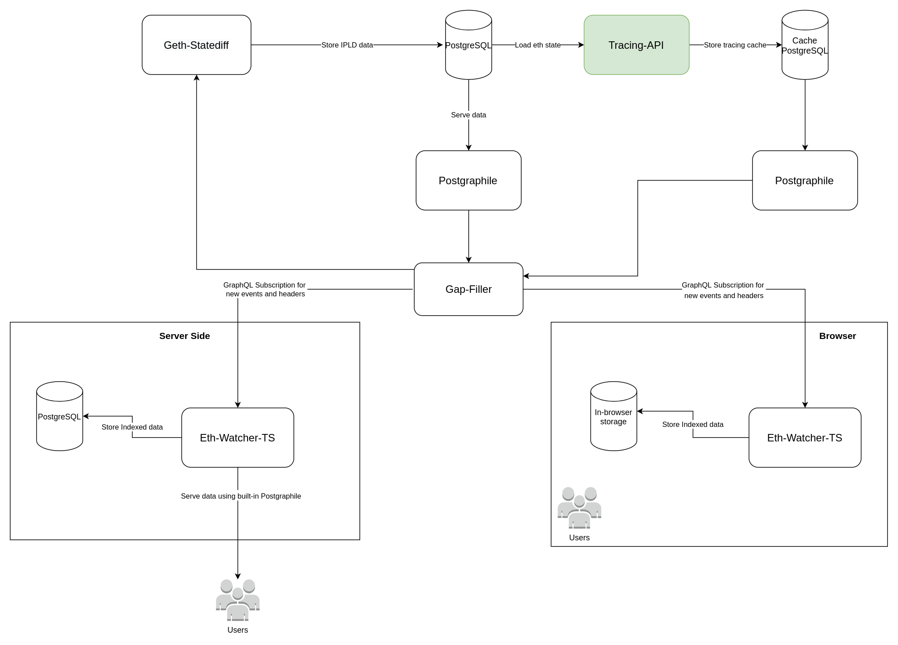

# tracing-api

tracing-api serves JSON-RPC endpoints which allows to get internal transactions by transaction hash.
It uses indexed ETH IPLD objects from [geth-statediff](https://github.com/vulcanize/go-ethereum/releases)

## JSON-RPC endpoints

The currently supported standard JSON-RPC endpoints are:
* `debug_txTraceGraph` - returns traces in graph format

   Input:
    * `hash` - transaction hash to trace
    
   Output: returns [`TxTraceGraph`](./pkg/cache/package.go#L41) object with frame list.
   [`Frame`](./pkg/eth/tracer/call_tracer.go) contains:
    * From
    * To
    * Input
    * Output
    * Gas
    * Cost
    * Value
    
* `debug_writeTxTraceGraph` - executes `debug_txTraceGraph` method and write output to cache database.
    
    Input:
     * `hash` - transaction hash to trace
        
    Output: empty

## Application Diagram



## Environment Variables

| Name                      | Default Value    | Comment                          |
|---------------------------|------------------|----------------------------------|
| DATABASE_NAME             | vulcanize_public | Source database name             |
| DATABASE_PORT             | 5432             | Source database port             |
| DATABASE_HOSTNAME         | localhost        | Source database host             |
| DATABASE_USER             | postgres         | Source database user             |
| DATABASE_PASSWORD         |                  | Source database password         |
| CACHE_DATABASE_NAME       | vulcanize_public | Cache database name              |
| CACHE_DATABASE_PORT       | 5432             | Cache database port              |
| CACHE_DATABASE_HOSTNAME   | localhost        | Cache database host              |
| CACHE_DATABASE_USER       | postgres         | Cache database user              |
| CACHE_DATABASE_PASSWORD   |                  | Cache database password          |

## How to build

### Docker

We provide Dockerfile, so to build docker image run:

```
make make docker-build
```

### From source

Minimal build dependencies

* Go (1.13)
* Git
* This repository

Build the binary:

```
make linux
```

## How to run

Prepare environment variable that describe above

### Using docker

```
docker run -e DATABASE_NAME=.. -e DATABASE_PORT=.. vulcanize/tracing-api
```

### Local binary

```
./build/tracer-linux serve
```

## Integration tests

Integration tests works with Github Actions on PR and commits to master branch.

It runs:
* ipfs node
* postgresql for geth-statediff
* postgresql for tracing service
* postgresql for TheGraph node
* geth-statediff
* openethereum (in private network with geth)
* TheGraph node
* [contract service](./test/enviroment/contracts) - service to build and deploy subgraph and perform smart contract calls
* tracing service (this repo)

To run it manually:

```
cd test/enviroment 
docker-compose pull 
docker-compose up -d
```

Wait a couple of minutes. You can run this script to check services up and running:

```
while [ "$(curl -s -o /dev/null -w ''%{http_code}'' localhost:3000/v1/healthz)" != "200" ]; do echo "wait for contracts being deployed..." && sleep 5; done
```

To execute integration tests:

```
cd test
go test -v .
```